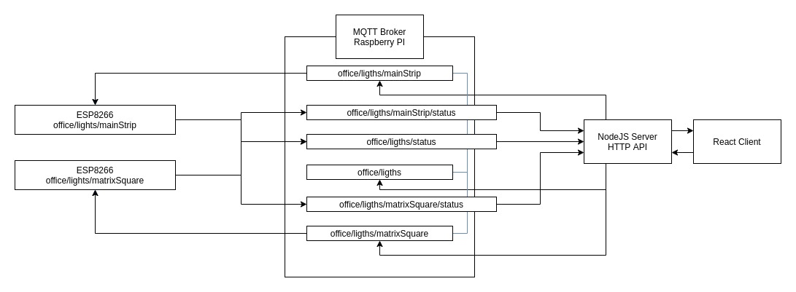

# esp8266-noob

## Inner projects

There is the ESP8266 `app` code. This code is sent to the ESP8266 using the Arduino IDE interface. It controls a LED strip.

There is the `server` code. Responsible for connection w/ ESP8266 and local network. Handles communication between `app`s and `client`s.

There is the `client` code. Responsible for creating a user test interface. Communicates w/ the server / api.

## Hardware

- WS2812 LED strip. 144 LEDs in 1m. (60mA / LED)
- ESP8266 NodeMCU Module
- Power supply:
  - 5V 10A
- Capacitors:
  - 1x 470µF
- Resistors:
  - 1x 470Ω

## Some docs:

### How I Set Up my LED at home by myself.

I wanted to setup some RGB LED lights at home.

II was watching some youtube videos and I saw a lot of people using some light hubs that could control a lot of light, control their color, some effects and stuff like that. 

I checked how much I would have to spend just to setup those things and thought "Ok... I'm not going to spend that much only on this". So I started studying a way to do it at home.

In the past I worked a little bit with Arduinos and other uControllers. So I was thinking about using an ESP8266 to be my uController for this project. Later I discovered that this is a very common setup. I bought a WS2812B 5050 LED strip w/ 144 LED / meter, a 5V/10A power supply and a new ESP8266.

The first thing I thought was to write an app using the Aruino IDE and then later building a server and client application. Initially the server would handle web socket connections w/ each ESP. So every ESP could connect to the server broker easily.

Later I changed the infrastructure to work like this:

There is a raspberry pi working as a mosquitto broker. Every ESP will connect to local network if available, if not it will fire up a wifi hotspot to configure the local network connection. When the ESP connects to the local network it will try to connect to the broker. When connected it will subscribe to a public path event listener (office/lights) and to a direct command path (office/lights/mainStrip). Once connected and subscribed it will publish it's current state to the public path status path (office/lights/status), so if there is a server up it will register the new light on the network. 

The node server connects to the brooker, subscribes to the /status paths and published to the base paths. So if we want to set all office/lights to blue we publish to the office/lights path w/ the rgb params. If we want to set only the mainStrip to blue we publish to the office/lights/mainStrip path  w/ the rg params. Some express routes in the node server makes it easy to run the commands using a HTTP interface, which will be used by the react client.

The node server also has a memory database that can sync to a pouchdb to store the last available lights registered in the network.

Since it's all based on events it's possible to upgrade the ESP  code to sync w/ other light events.

Also you can fire many node servers easily and make custom local servers. Like a public server that has auth and a local server to avoid auth because it's a local environment.

Who everything connects:

The React interface. (It looks like shit, but it's just to test it hahah)

How it looks:

## Prototype & Result

## Roadmap

[] Attach another LED strip and deveop some functions in the server to control both of them