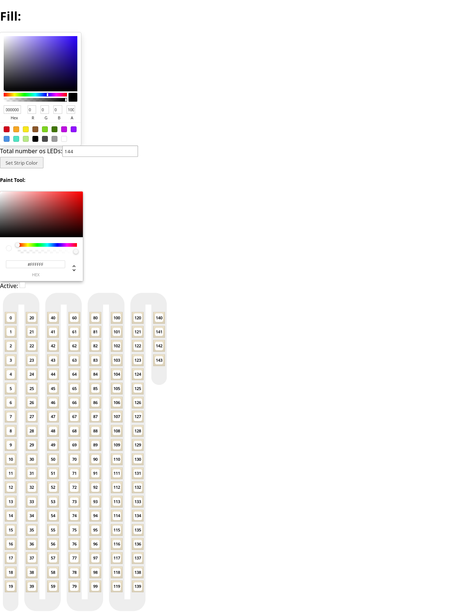
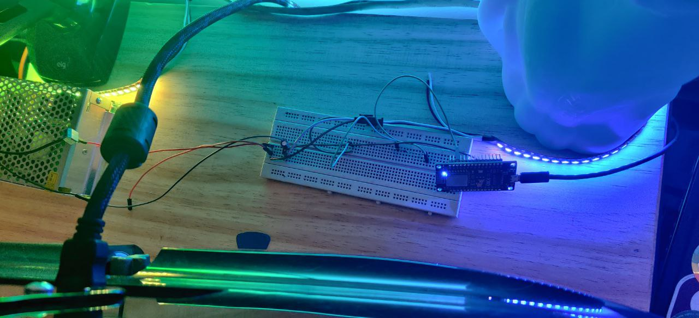

# esp8266-noob

## Current test interface

## Inner projects

There is the ESP8266 `app` code. This code is sent to the ESP8266 using the Arduino IDE interface.

There is the `server` code. Responsible for connection w/ ESP8266 and local network. Handles communication between `app`s and `client`s.

There is the `client` code. Responsible for creating a user test interface. Communicates w/ the server / api.

## Prototype & Result

